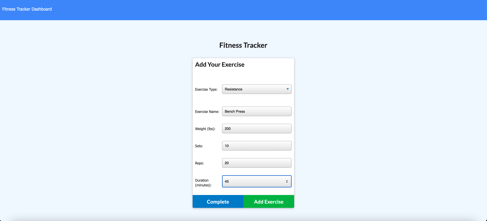
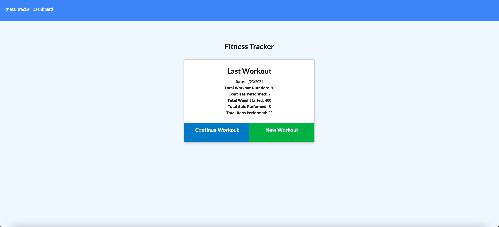
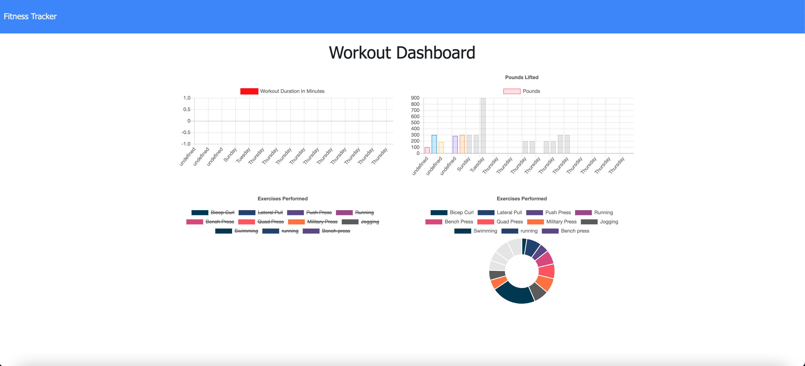

# workout-tracker

## Approach 

This workout-tracker is comprised of many working parts that all seamlessly come together to build a polished, professional application that keeps track of all the users current workouts. The user is able to track the name, type, weight, sets, reps and duration of the exercise. If the exercise is cardio then they can track distance and if it is resistance they can track the total weight lifted.These workouts are compiled in a stats page that has graphs and pie charts so the user can easily look at and digest all of the information that is presented before them. The drive behind building this application is that a consumer will reach their fitness goals more quickly if they can track their progress. Behind the scenes there is many technologies at play, the main one being mongoDB, cross-platform document-oriented database program. The node modules that help along the way are mongoose, express and morgan. With the use of MongoDB, we are able to store users data in a database with BSON objects. With the info in a databse we can dynamically display that info back to the user. All of this comes together to make a user friendly, workout tracking application that will help users accomplish their goals.

## Installation

To install this repo on your local drive you would have to clone the ssh key from my repo. Head into your local drive of choice in terminal or bash and do a git clone. Once you have done a git clone you are free to start working on this project. If you want to push your changes to my repo then you would have to head into terminal/bash and do a git add . Then a git commit -m explaning the changes made, and finally a git push to push the files onto the repo. 

## Usage 

If you want to use this program on the front end then simply click on the link in the finished project section of this read me. If you would like to tinker with the back-end, first do a git clone as previously described. Once you have the all the folders in your vs code, make sure you do a npm install in the command line to install all the dependencies listed in the package.json. Then go to the server.js file and check the port you are listening on and make sure you are able to spin up a localhost:[PORT NUM]. Go into the intergrated terminal and run the command npm start. This will spin up a local server enabling you to make changes in your editor of choice and see them in the browser. 

## Finished project
Check out the live application on <a href="https://ancient-taiga-78237.herokuapp.com/">Heroku!</a>

## Features
<ul>
<li>A workout tracker that will help users accomplish their goals.</li>
<li>The user is able to view, create and track daily workouts.</li>
<li>Can log multiple workouts on a given day.</li>
<li>User is able to track the name, type, weight, sets, reps, and duration of exercise.</li>
<li>If it is a cardio workout then the user is able to see the total distance.</li>
<li>If it is a resistance workout then the user is able to see the total weight lifted.</li>
<li>When the user starts the application they are given the option to create a new workout or continue with their last workout.</li>
<li>Can add exercises to the most recent workout plan. </li>
<li>Can add new exercises to a new workout plan. </li>
<li>View the combined weight of multiple exercises from the past seven workouts on the stats page. </li>
<li>View the total duration of each workout from the past seven workouts on the stats page.</li>
<li>Uses MongoDb as the database</li>
<li>Uses the node modules Mongoose, Express, and Morgan.</li>
<li>Have different routes for seperate pages so we are able to post and get data from MongoDB.</li>
<li>Application is hosted live on <a href="https://ancient-taiga-78237.herokuapp.com/">Heroku!</a>.</li>
</ul>

## Tests
N/A 

## Credits
N/A

## Contributing

Pull requests are welcome and encouraged. Hit me up on my github <a href="https://github.com/mattrward1030">mattrward1030</a>

## Badges
 

## License

MIT License

Copyright (c) [2021] [Matthew Ward]

Permission is hereby granted, free of charge, to any person obtaining a copy
of this software and associated documentation files (the "Software"), to deal
in the Software without restriction, including without limitation the rights
to use, copy, modify, merge, publish, distribute, sublicense, and/or sell
copies of the Software, and to permit persons to whom the Software is
furnished to do so, subject to the following conditions:

The above copyright notice and this permission notice shall be included in all
copies or substantial portions of the Software.

THE SOFTWARE IS PROVIDED "AS IS", WITHOUT WARRANTY OF ANY KIND, EXPRESS OR
IMPLIED, INCLUDING BUT NOT LIMITED TO THE WARRANTIES OF MERCHANTABILITY,
FITNESS FOR A PARTICULAR PURPOSE AND NONINFRINGEMENT. IN NO EVENT SHALL THE
AUTHORS OR COPYRIGHT HOLDERS BE LIABLE FOR ANY CLAIM, DAMAGES OR OTHER
LIABILITY, WHETHER IN AN ACTION OF CONTRACT, TORT OR OTHERWISE, ARISING FROM,
OUT OF OR IN CONNECTION WITH THE SOFTWARE OR THE USE OR OTHER DEALINGS IN THE
SOFTWARE.
